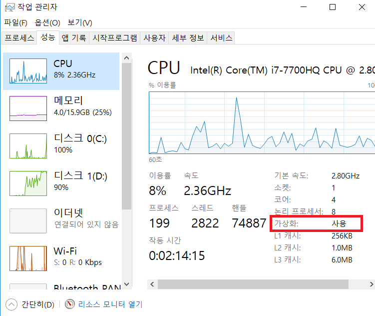
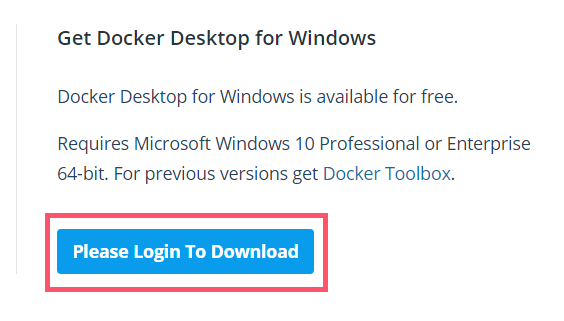
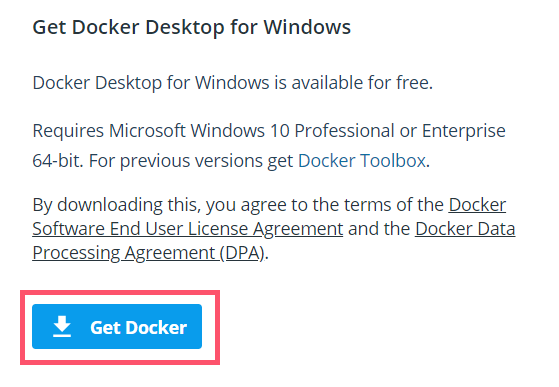
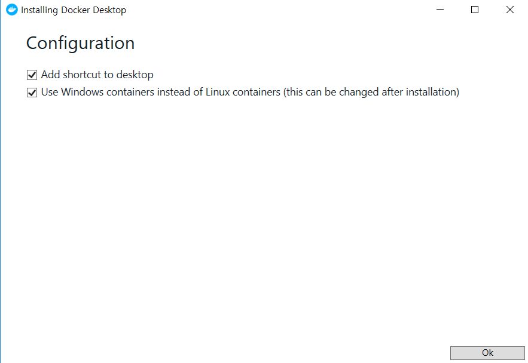
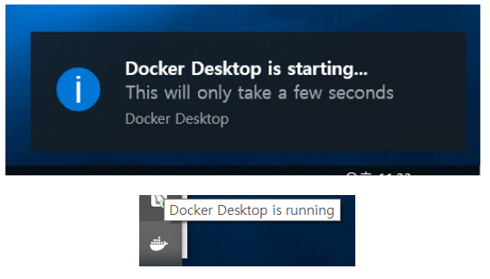
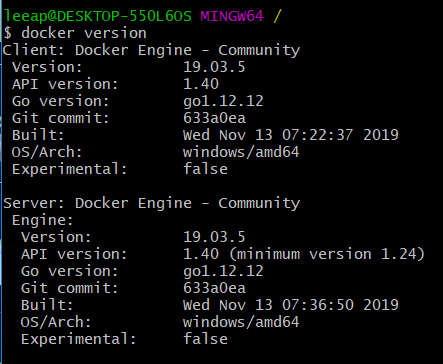
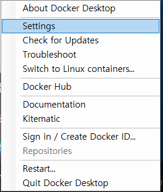
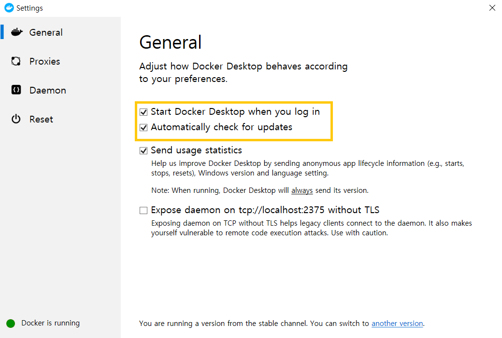
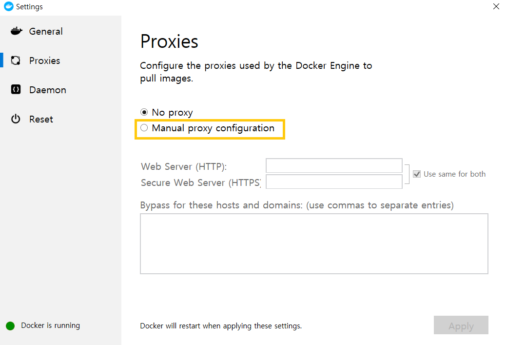

---

## [1] 가상화 기능 활성화 확인

도커는 윈도우용/macOS용에서 안정(stable)버전과 개발(edge)버전으로 나위어 제공된다.

윈도우용 도커를 실행하려면 가상화 기능이 필요하다.

> <b style="color:gray;">가상화 기능 활성화 확인</b>
>
> 작업관리자 > CPU탭 > 가상화 항복 '사용' 확인
>
> 
>
> <br>
>
> 사용하지 않음으로 되어있다면 컴퓨터 바이어스(UEFI0) 설정에서 가상화 기능을 활성화 해야한다.

<br>

### [2] Docker 다운로드 및 설치

[도커 다운로드 url](https://hub.docker.com/editions/community/docker-ce-desktop-windows)에서 윈도우용 도커 안정버전을 받을 수 있다. 회원가입 후 아래의 버튼을 클릭하면 된다.





도커 인스톨러 파일을 다운로드 했다면  Hyper-V 기능을 활성화 하고 확인버튼을 눌러 설치 완료 후 윈도우를 재시작한다.





도커가 실행되고 작업 표시줄에 Docker is running이라는 메세지가 나타나면 정상적으로 설치된 것이다.

도커가 실행된 상태에서 PowerShell(혹은 gitbash)을 통해 `docker version `명령어 실행시 현재 도커버전 확인이 가능하다.



```
간혹 윈도우에서 메모리 확보 실패 등 이유로 실행 실패하는 경우가 있는데, 서비스 재시작 혹은 설정에서 CPU 혹은 메모리 할당을 줄여야한다.
```

<br>

## [3] Docker 기본 설정

도커 아이콘 > 오른쪽마우스 클릭 > settings 클릭



---



### - 도커 자동 실행 설정

Gerneral 탭에서 'Start Docker Desktop when you log in' 체크를 하면 운영체제 로그인 시 도커가 자동으로 실행된다.

### - 자동 업데이트 확인

Gerneral 탭에서 'Automatically check for updates'를 체크하면 최신 버전 출시만 알려줄 뿐 강제 업데이트가 일어나진 않는다.

---

### - 프록시

'Proxies' 탭에서 원격 도커 저장소에서 도커 이미지를 받아올 떄 사용할 HTTP/HTTPS 프록시를 설정할 수 있다. 제한된 대상에만 접근을 허용하는 프라이빗 저장소로부터 이미지를 받아와야하는 경우에는 'Manual proxy configuration'을 선택해서 설정하면 된다.




