---

## [1] 리눅스 기본 알기(계획- 파티션, 메모리 ... )

> ★ 파티션[^ 하나의 물리적인 디스크를 여러개의 논리적 디스크로 나누는 것]
>
> - 일반적으로 리눅스를 설치할 디스크에 파티션을 나눠서 사용한다.
> - 특별한 이유가 없는 한 다음 5개 정도의 파티션으로 나누어 설치하게 된다.
>
> 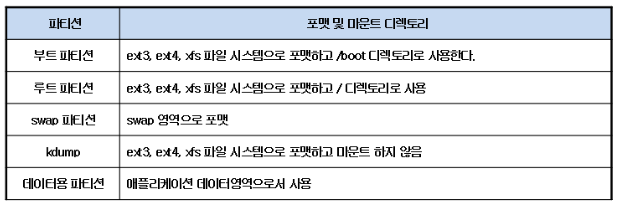
>
> 1. 부트 파티션은 커널과 초기 RAM 디스크를 포함, GRUB에 관련된 파일을 저장하기 때문에 100(보통128)MB 정도면 충분하다.
> 2. /(루트) 파티션은 인스톨 예정의 RPM 패키지와 애플리케이션 소프트웨어를 인스톨 할 수 있는 정도의 사이즈가 필요핟.
> 3. swap 영역은 RHEL에서 추천하는 다음 계산을 따른다.
>
> ​       메모리가 2GB 이하 : 물리 메모리의 2배
>
> ​       메모리가 2GB 이상 : 물리 메모리 + 2GB
>
> 4. kdump는 물리 메모리 사이즈의 2~3배 정도가 알맞다.
> 5. 데이터용 파티션은 애플리케이션 데이터 영역으로 운용 중에 데이터가 계속 증가할 영역으로 따로 파티션을 잡아두는 것이 좋다. 
>
> - 디스크 파티션 설정 화면에서는 “Default Layout” 이 아닌 “Custom Layout”를 선택해서 명시적으로 파티션을 구성하도록 한다.
> - LVM(Logical Volume Management)는 사용하지 않는 것이 원칙이다. (설치 시)
> - 데이터 양이 일정 한 영역과 데이터가 증가하는 영역으로 나눠서 관리하는 것이 디스크 관리의 기본이다.
>
> 
>
> **★ 마운트 (Mount)** - 특정 디렉토리에 파일시스템을 탑재 하는 것
>
> - 리눅스 파일 단위로 모든 장치를 관리하기때문에 새롭게 만든 파일 시스템 사용하기위해서는 디스크 장치를 임의의 디렉토리에 마운트 시켜 사용해야한다.
>
> **마운트 포인트 ( Mount Point )** - 디스크 장치와 디렉토리가 연결이되어야 하는데 이때
>  연결되는 디렉토리이다.
>
> [마운트가 잘 정리된 블로그](https://kimhyun2017.tistory.com/21)

---

## [2] 설치하기

**Virtual Box는 실제 서버 장비의 운용 전에 테스트 용도로 사용한다** 

[가상 머신 다운받기](https://www.virtualbox.org/wiki/Downloads)

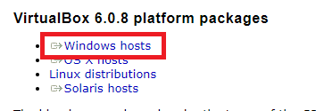

---

## [3] 가상 머신 만들기

다운로드가 완료되었다면, 가상머신을 만들어보자!

#### 1, 새로만들기 클릭

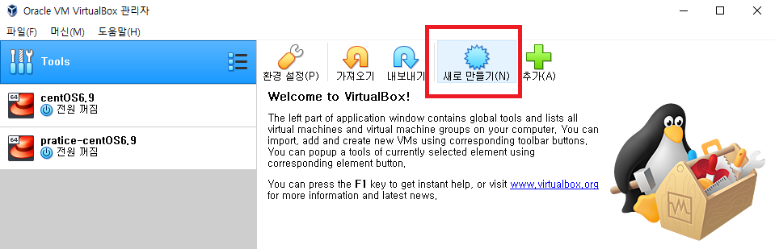

 

#### 2, 가상 머신 이름, 경로 설정

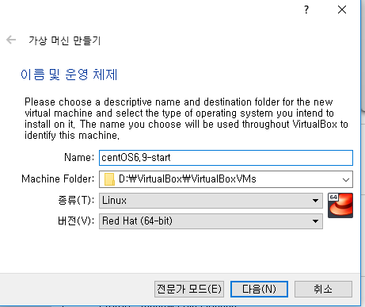

#### 3, 메모리 설정

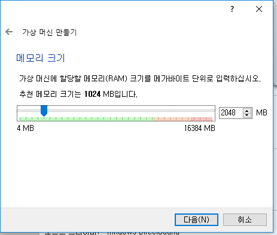

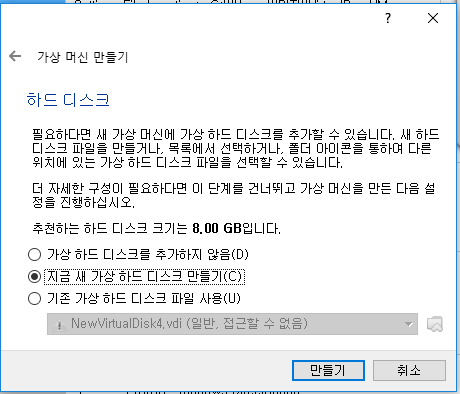

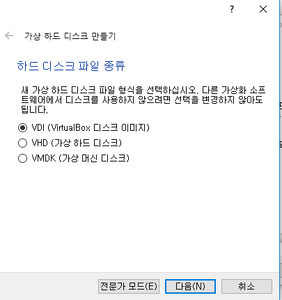

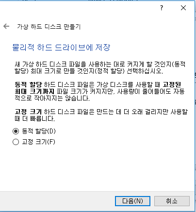

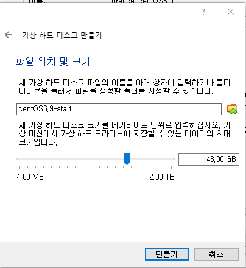

---

####  만들 가상 머신 설정

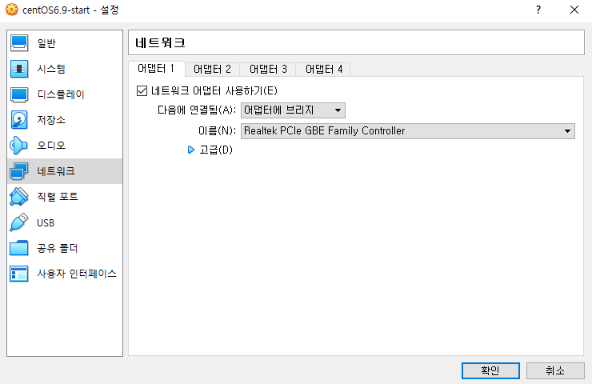

> NAT : 주소 변환(IP주소를 변환) => 가상머신이 사설 IP로 잡힘, 내부 접근 불가(?)
>
> <https://dany-it.tistory.com/36>

> 브리지 : 가상 스위치 (같은 네트워크에 있을 수 있게 설정 )

**어댑터에 브리지** 로 설정

#### 저장소 설정

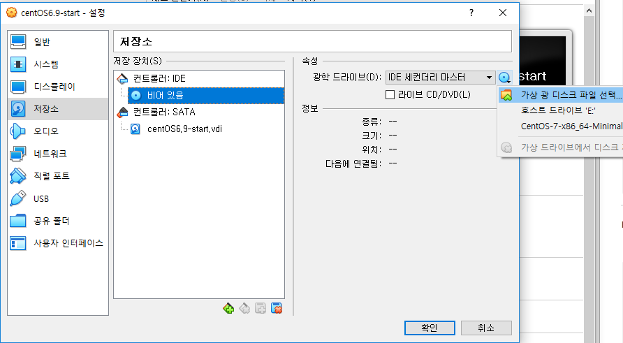

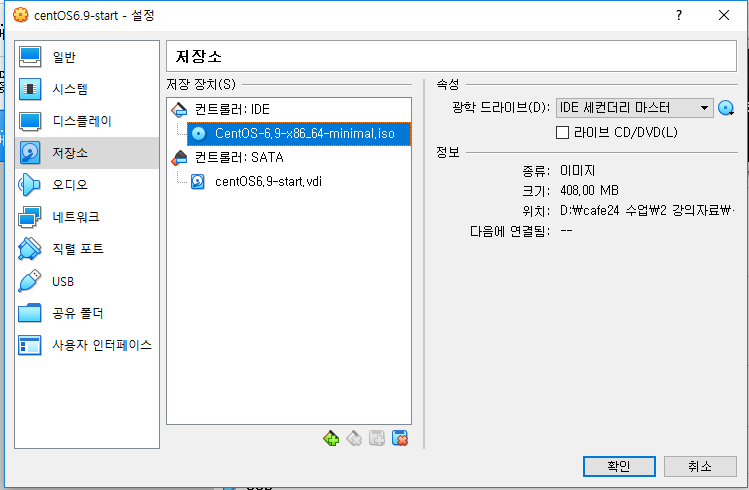

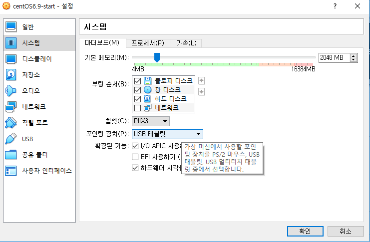

