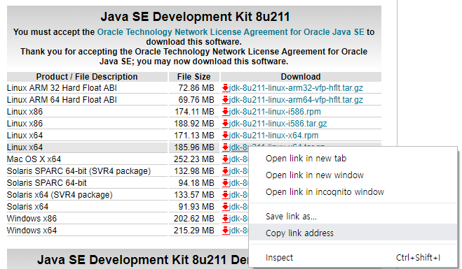
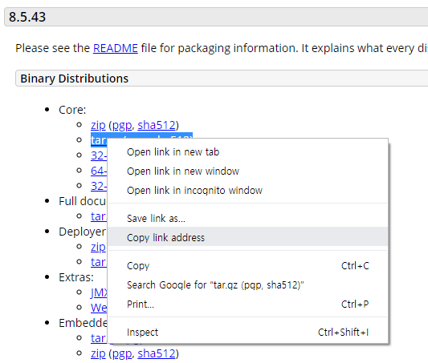
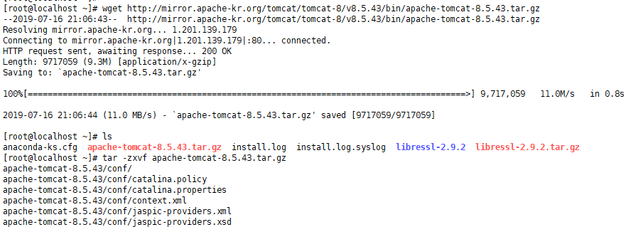
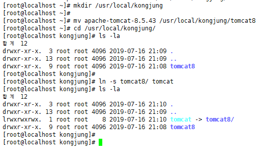
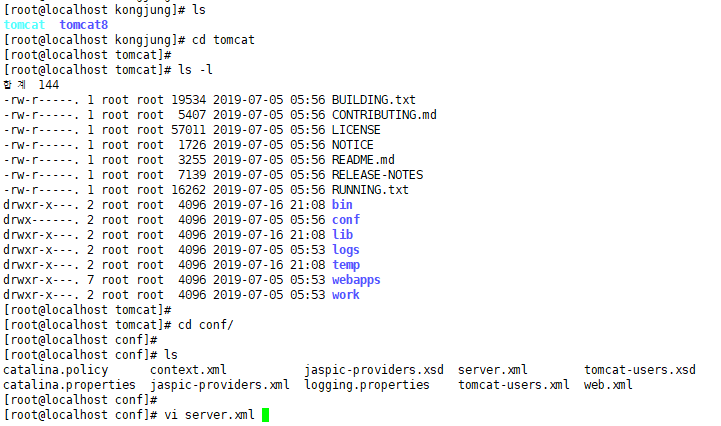
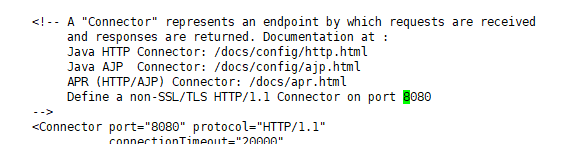
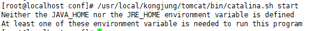

---

<center>
<figure>

<figcaption></figcaption>
</figure>
</center>

---

## Java

[다운로드](https://www.oracle.com/technetwork/java/javase/downloads/jdk8-downloads-2133151.html)




## Tomcat

[다운로드](https://tomcat.apache.org/download-80.cgi)


















```
Neither the JAVA_HOME nor the JRE_HOME environment variable is defined
At least one of these environment variable is needed to run this program

```


